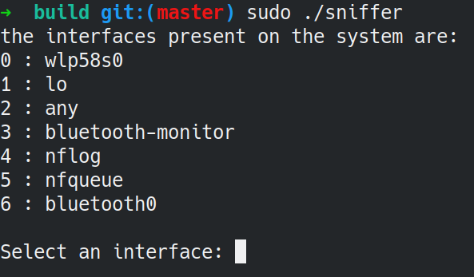
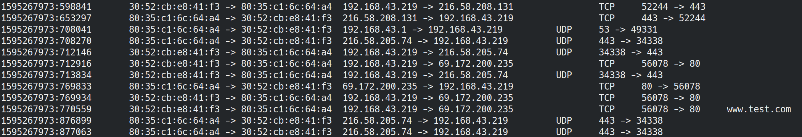

# Packet Sniffing using Libpcap
Analyzing network traffic allows to study and appreciate the details of the functioning of the underlying layer. If you are wondering how to analyze network traffic then this project is for you.
This repository contains the source code of a network traffic analyzer written in `C++`.


## Compile you project

### Installing libpcap

This project is based on `libpcap` so you have to install `libpcap-dev` package on your Linux distribution:

````bash
sudo apt-get update
sudo apt-get install libpcap-dev -y
````

---

To compile the project I suggest you to use [CMake](https://cmake.org/). These commands can be used to compile your source code using [CMake](https://cmake.org/):

``` bash
mkdir build && cd build
cmake .. && make -j $(getconf _NPROCESSORS_ONLN)
```

That is all!
After that you can execute your `sniffer` as following:

``` bash
sudo ./sniffer
```


## Start to use the tool



First you have to select the interface to use for your sniffing session.
The list of all interfaces that are present in your system will be displayed when your sniffer will be launched as well.

---

The information reported on the screen by the tool are structures as following:

``` timestamp		MAC_src -> MAC_dst		IP_src -> IP_dst		Protocol		PORT_src -> PORT_dst ```

If the packet is contains an `HTTP` request (e.g., a *POST* / *GET* command) the *URL* present in the packet is extracted and then displayed to the user.

In this example the output of the tool is shown. In particular, each line displayed in your terminal represent one single packet that is processed by the tool.

